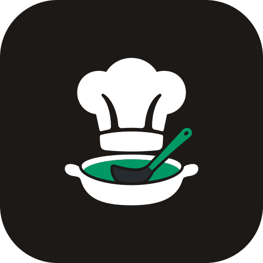

<p align="center"></p>

# Sous Chef

[Website](https://sous-chef-website.vercel.app) · [Try the live demo](https://souschef-demo.onrender.com/demo) · [Self-hosting guide](DEPLOYMENT.md)

Sous Chef is an **AGPL-3.0 open-source, self-hostable kitchen assistant**. Keep
pantry stock, recipes, cooking, and shopping lists on your own server. Optionally
connect to a shared recipe community backed by Convex.

## Run at home

With Docker installed, run the prebuilt image (no repository clone or build):

```sh
docker run -d --name sous-chef --restart unless-stopped \
  -p 3000:3000 -v sous-chef-data:/data \
  ghcr.io/gamerg21/sous-chef:latest
```

Open `http://localhost:3000` on that computer, or `http://YOUR-SERVER:3000` and create your local account. The first account is
the instance administrator. No Convex account, database service, email service,
or AI key is required. One app container stores its SQLite database, photos, and
generated encryption key in a persistent volume.

See [deployment](DEPLOYMENT.md), [Docker settings](DOCKER.md), and
[backup/recovery](docs/BACKUP.md). Existing Convex users should read
[the migration guide](docs/SQLITE_MIGRATION.md) before updating.

## What works

- Household membership, roles, and switching between kitchens.
- Pantry/fridge/freezer inventory, quantities, expiration dates, and photos.
- Recipe editing, structured import/export, favorites, and ingredient mapping.
- Unit-aware cooking deductions, shortage previews, shopping lists, and stocking purchases.
- Barcode lookup through Open Food Facts; camera scanning needs trusted HTTPS.
- Local email/password accounts, optional reset emails, and operator password recovery.
- Optional pantry recipe drafts using your own OpenAI, Anthropic, or Google key.
- Optional community account connection, publication/unpublication, browsing,
  search, and importing independent recipe copies with photos and attribution.
- Public `/explore` page and portable recipe downloads; no local account needed.
- Hosted-demo mode with an isolated, temporary sample kitchen for each visitor.

Community sharing requires a configured, separately operated service. Community
likes/comments, federation, automatic recipe synchronization, native apps, and
phone use without access to the home server are not implemented. The extension
catalog remains a preview; integrations cannot be connected.

## Architecture

```text
Browsers → Next.js server → SQLite on the server's local disk
                 │
                 └─ optional HTTPS → shared Convex recipe community
```

Private household data stays local. Publishing sends an explicit recipe
snapshot; importing creates a local copy. Community downtime does not prevent
local kitchen use. Core screens refresh after local writes and poll every five
seconds for changes made by another household member.

SQLite uses WAL mode, indexed JSON records, and serialized transactions. The
existing typed schema and validation descriptors are reused through the Convex
JavaScript library; **there is no Convex runtime or deployment in the local
kitchen**. Domain functions live in `src/server/kitchen/`. `convex/` contains
only the community backend and its authentication.

## Develop

Use Node.js **22.18+** and the exact pnpm version pinned in `package.json`:

```sh
corepack enable
pnpm install --frozen-lockfile
pnpm dev
```

Schema creation, unit seeding, and secret-key creation happen automatically.
Set `SOUS_CHEF_DATA_DIR` to choose a different local directory (default `./data`).
Do not put that directory on a network share or in source control.

```sh
pnpm run doctor
pnpm test
pnpm type-check
pnpm lint
pnpm build
pnpm run check:docs
```

`pnpm dev` starts only Next.js. `pnpm dev:backend` is exclusively for developers
working on a specifically selected community Convex deployment.

For the public demo update pipeline, see [automatic demo deployments](docs/RENDER_DEMO.md).

## Community and hosted demo

Set `COMMUNITY_API_URL` to the service's `https://…convex.site` origin and
`COMMUNITY_CONVEX_URL` to its `https://…convex.cloud` origin. Then open
Community → Connect community account. Local and community accounts are separate.
No deploy/admin key is distributed to installations.

Set `SOUS_CHEF_DEMO=true` on a separately hosted app to open the demo entry
page at `/demo` when visiting `/`. Normal local instances still open directly
into the kitchen at `/`. Marketing lives in a separate website codebase;
the kitchen app does not serve `/welcome`.
Each demo expires after 24 hours; run the cleanup command described in
[community operations](docs/COMMUNITY.md). Demo mode disables AI/provider
settings and instance administration. Hosting requires a persistent disk and
one app process, not an ephemeral serverless filesystem.

See [community operations and API](docs/COMMUNITY.md) for setup, limits, and
remaining public-launch work. See [contributing](CONTRIBUTING.md) and
[agent guidance](AGENTS.md) for development boundaries.

## License

Sous Chef is licensed under [GNU AGPL-3.0](LICENSE). The optional Convex service
has its own dependencies and licensing; using it is not required to run your kitchen.

## App updates

Settings → System & Updates shows the installed version and newer stable releases.
See [managed updates](docs/UPDATES.md) for one-button Docker updates, portable Linux
packages, backups, and recovery.
